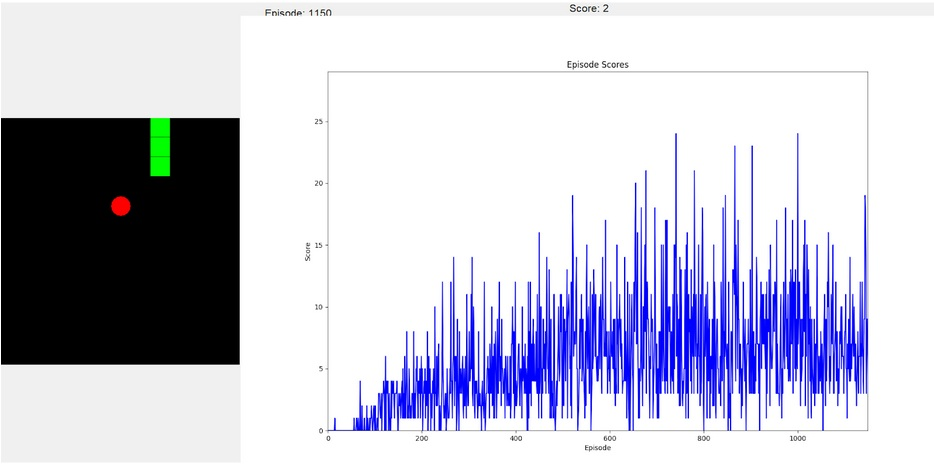

# 🐍 Snake Game AI using Deep Q-Learning (DQN)

This project implements an AI agent that learns to play the classic Snake game using **Deep Q-Learning (DQN)**. It uses **PyTorch** for the AI model and **Tkinter** for real-time game visualization, along with live performance tracking using **matplotlib**.

---

## 🚀 Features

- 🎮 Snake game built using Tkinter
- 🧠 AI agent trained using Deep Q-Learning (DQN)
- 📈 Live plot of score over episodes
- 🎯 Real-time movement, food detection, and learning
- 🧪 Epsilon-greedy exploration for balanced learning
- 🧠 Replay memory for efficient learning from past experience

---

## 📷 Demo

---

## 🧠 What is Deep Q-Learning?

Deep Q-Learning is a **Reinforcement Learning (RL)** algorithm where an agent learns by interacting with an environment:
- It **observes the current state**
- **Chooses actions** to get rewards
- **Learns over time** using a neural network to approximate the best decisions

In our case, the **agent is the snake**, and its goal is to **eat food without hitting walls or itself**.

---

## 🧩 How it works (Simple Explanation)

1. The snake (agent) sees:
   - Where the food is
   - Which direction it's moving
   - If it’s going to hit a wall or itself

2. The AI chooses an action:
   - Move Up / Down / Left / Right

3. Based on the result, it gets a reward:
   - +10 for eating food
   - -10 for hitting a wall or itself
   - 0 for just moving

4. The AI remembers what it did, learns from it, and tries to do better next time.

---
